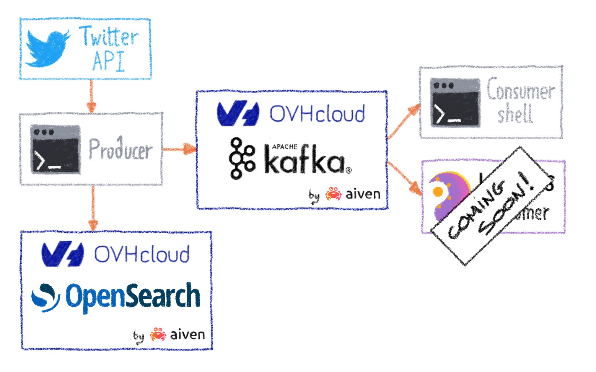

# Kafka Producer / Consumer connected to Twitter API

In this tutorial, we will play with the new [Kafka service](https://www.ovhcloud.com/fr/public-cloud/apache-kafka) offered by [OVHcloud](https://www.ovhcloud.com/).

We will use the [Twitter v2 API](https://developer.twitter.com/en/docs/twitter-api) to produce data and then send it to the Kafka cluster.

We will finish by creating a small monitoring tool in [Bash](https://www.gnu.org/software/bash).

Note: In a future release, we will develop a web page that will expose the Kafka cluster stream.

To make it easier for you, you can run this tutorial entirely via [Gitpod](https://www.gitpod.io) ❤️, just click on the *Open in Gitpod* button provided.

## Let's go, have fun with OVHcloud managed Kafka

The tutorial is organized in several successive steps. You can start at any stage, each stage contains the necessary content required.

### STEP 01 - Subscribe and connect to a new OVHcloud managed Kafka service

👟 [Jump to Step01](../..//tree/main/step01)

### STEP 02 - Get access to the Twitter API

🤿 [Dive in Step02](../..//tree/main/step02)

### STEP 03 - Create and launch the producer daemon

🥊 [Knock the Step03](../..//tree/main/step03)

### STEP 04 - Create a Bash consumer

👉 [Follow Step04](../..//tree/main/step04)
