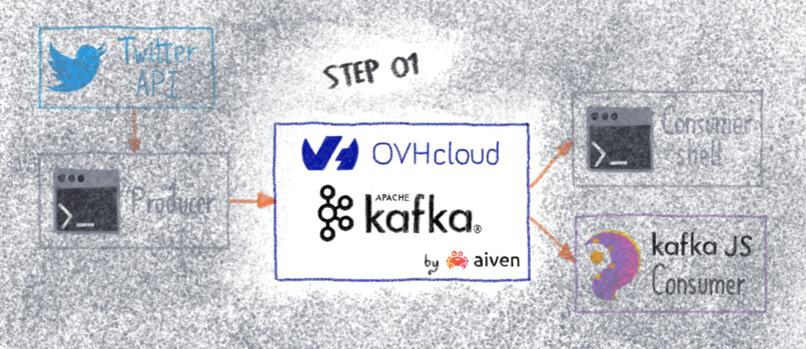
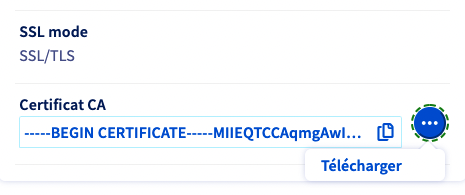
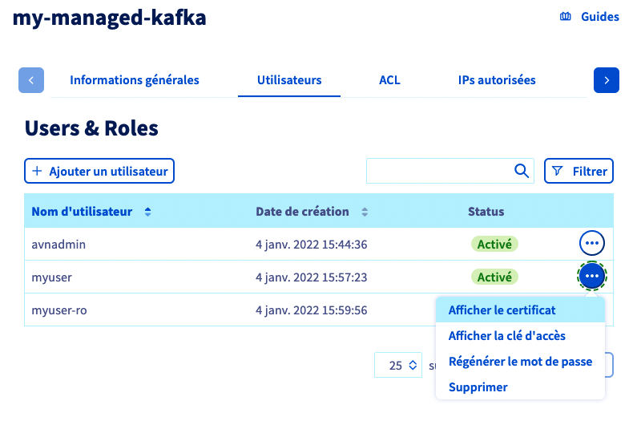
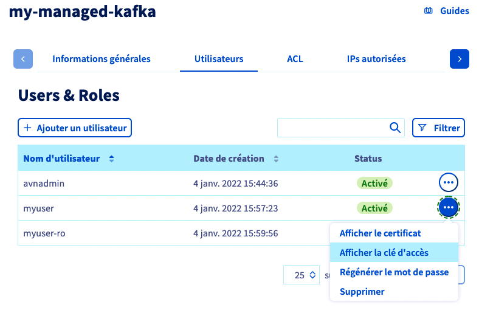
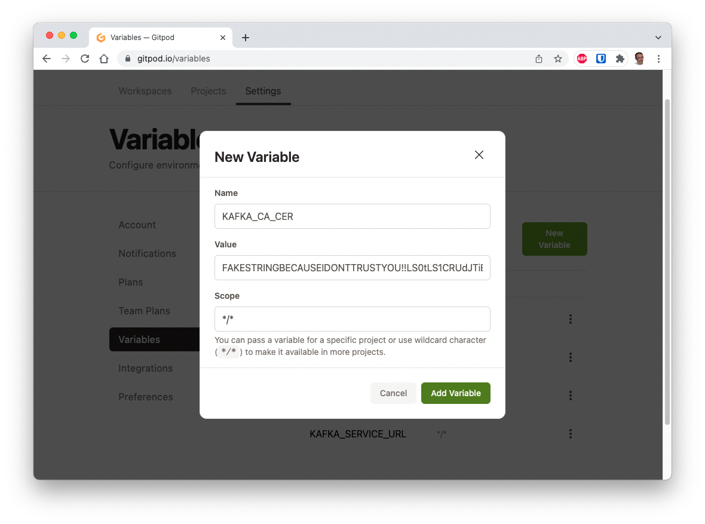
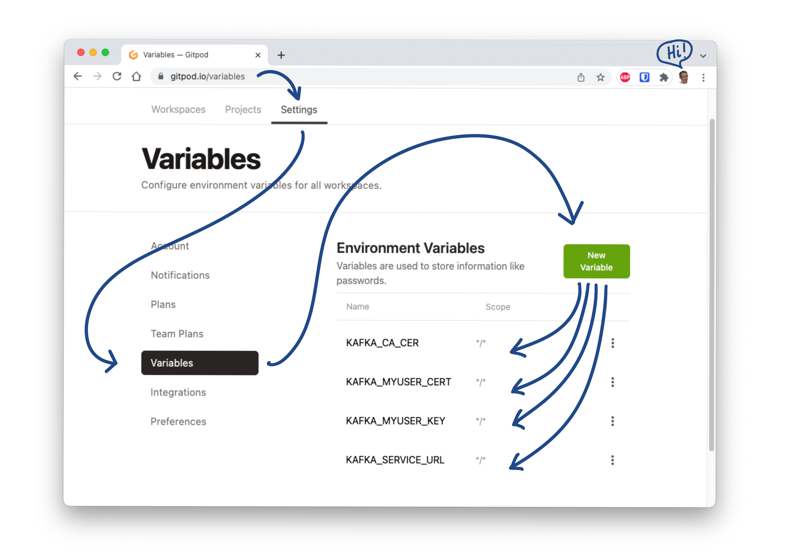
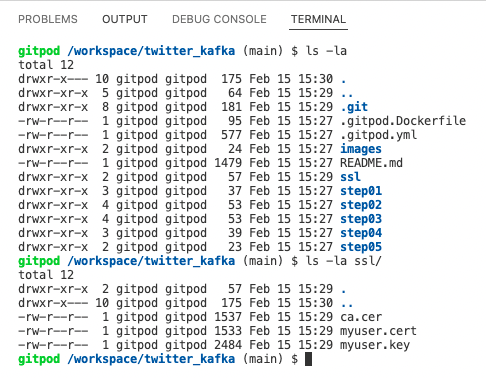

# STEP01 - Subscribe and connect to a new OVHCloud managed Kafka service



[](https://gitpod.io/#https://github.com/raclepoulpe/twifka/tree/main/step01)

## Create new OVHCloud managed Kafka

According this tutorial https://docs.ovh.com/gb/en/publiccloud/databases/kafka/getting-started:

- Subscribe to a new Managed Kafka service, and name it <span style="color: orange;">**my-managed-kafka**</span>
- Create a new user named <span style="color: orange;">**myuser**</span> (keep and save the given password).
- Create a new topic named <span style="color: orange;">**mytopic**</span>
- Configure this topic ACLs, by granting the <span style="color: orange;">myuser</span> user the **readwrite** privilege on the <span style="color: orange;">mytopic</span> topic.

## Prepare the producer environment

- Create the <span style="color: orange;">**producer**</span> folder, in your project workspace root folder:

```bash
mkdir producer
```

- Create the <span style="color: orange;">**producer/ssl**</span> folder:

```bash
mkdir producer/ssl
```

## Import the Kafka SSL certificates

### Get the Kafka service certificate

The CA certificate is accessible from the <span style="color: orange;">General Informations</span> tab of your Control Panel, by clicking on the Download link.



Now, copy the full text from the <span style="color: orange;">**ca.cer**</span> file and paste it inside a new <span style="color: orange;">**producer/ssl/ca.cer**</span> file.

### Get the user certificates

From the <span style="color: orange;">Users</span> tab, click on the the <span style="color: orange;">myser</span> associated menu, and select <span style="color: orange;">Print Certificate</span>.

Download the file and save it as <span style="color: orange;">**myuser.cert**</span>, copy the file content and paste all the text inside a new <span style="color: orange;">**producer/ssl/myuser.cert**</span> file.



From the <span style="color: orange;">Users</span> tab, click on the the <span style="color: orange;">myser</span> associated menu, and select <span style="color: orange;">Print Access Key</span>.

Download the file and save it as <span style="color: orange;">**myuser.key**</span>, copy the file content and paste all the text inside a new <span style="color: orange;">**producer/ssl/myuser.key**</span> file.




> :information_source: Make it easy for yourself, if you use Gitpod, you can store the contents of certificate files in variables, and thus have them available each time you create your workspace.
> Once you have retrieved the certificate files, transform the content of each file into a base64 encoded string.
> example:
>
```bash
cat ca.cer | base64
```
> give as result a tring like:
```
FAKESTRINGBECAUSEIDONTTRUSTYOU!!LS0tLS1CRUdJTiBDRVJUSUZJQ0FURS0tLS0tCk1JSUVRVENDQXFtZ0F3SUJBZ0lVYTcwMzJoQTdXclJDVzFpYVkrQmtCdkRSWmRRd0RRWUpLb1pJaHZjTkFRRU0KQlFBd09qRTRNRFlHQTFVRUF3d3ZNbUl4TldGaE9EUXRNVFF5TnkwME1tTTVMV0pqTjJJdE5tTXhOMlJpT1dObApPVGMxSUZCeWIycGxZM1FnUTBFd0hoY05NakV4TWpJd01URXhNVEU1V2hjTk16RXhNakU0TVRFeE1URTVXakE2Ck1UZ3dOZ1lEVlFRRERDOHlZakUxWVdFNE5DMHhOREkzTFRReVl6a3RZbU0zWWkwMll6RTNaR0k1WTJVNU56VWcKVUhKdmFtVmpkQ0JEUVRDQ0FhSXdEUVlKS29aSWh2Y05BUUVCQlFBRGdnR1BBRENDQVlvQ2dnR0JBTVRZa1I1UQpIZXJPbmJJNjhPSitMUlYwUGZzZVdWU216SFBmYmpieXJmMEdRRHFmYWJuTEVpZEorcjlxWlJKZ1diaUZoWFdwCmhTSkJwa2NsUVNEdDV4cU5hYkluTlFYM3hGV010OXE3VU52Rks4aWx1Q2ZLUVVYclNKWHlteDNGanNkTUxxdTIKUzZLZjFCSjMxNXVrcEZKb1A4VUx3emMwU0laWDNoZHVQRmRlWjZTaEZwdisva3hXYkJaaWZSK0xNalpCODFsawpSdmpjd2Ryc011TEdPa1AyYk0zVHBrK3hzbGphUCtyd3BNTWEvLzdGYVNkRFBxcnV1UDZVMlNYNWhJbGRZWTFNClJpVmVhMVljTUxxSGR0MjBtSkpIWmdhbyt0L2YzeUNXMExaZXR5czM3a2JqMGNqaFpBTEZqWTJpVWpzRzlOdEoKQlRUSGEwamRiU0NMNmFMcmR6OTEyazBQZ0F0Vkw0aElHSHFTYWpUcFpJb0x6OGhKWEQ2d3JZeGswVWNla0VsdApFbkk0d3BjMGlaYndwUVZ4Y3BIZjU2a1hMOWtjYmFjU2VGWTE1UUpKSmlja083b1JJNUtWWHRmdGVqZUVVN0lRCmY2WmZ6ckE0aWdMNzBCdWdhRFhBdFlNdEZkam03VTF1SWNEa3hqTnpQNkcyQzZZcldsWXJveUkwZlFJREFRQUIKb3o4d1BUQWRCZ05WSFE0RUZnUVVIRjBGMjMrVERYUGFsRkZSYlBBc2pYU2t5N1V3RHdZRFZSMFRCQWd3QmdFQgovd0lCQURBTEJnTlZIUThFQkFNQ0FRWXdEUVlKS29aSWh2Y05BUUVNQlFBRGdnR0JBS1dEbTZ3MnYwUGJ3MDhNCkk5eFFWcXlTNWJueWcyUUVFdHdMaHJnLytPeGg0aXU1Y0QxVWN1d0dtc1BFaE15TTUxZTA3ZWtodFR0bjBQU1UKTnZUL0hxTVYzdHRVd1daVlFTdUlHRnUza3N2Sjcyc3g3dHZva0pmblpINWRSVkViNTdJem1CNUF2alBMb0ZuOAp1QzlFZHFnWWg3Ym9FR1JkTWlrT0d3UjRUSUZGYmk0eVJEd2JDaW1nb0d2UWUzQXV3eWorcWkvTlBJeG5GL3IwClQvSVFhdmxGc2dHei9UcTRHQjl5Wjl6dE5SNTRpVU9UREczY0haZUlOUTgvWEpnOUhBL2xyTmozemNzdjRtaHEKME9ITWtKbWNxb2tvMUpmZTRRQnNaQ0hxWjFQbDVtc2xCd05QOUpkQ0NkWlMzZzFIZTE5ZHVwd1VNalFDQ2xqeQpnRVk2Z0VyQnhiSUs0eG5XdlZqZzcvZjlsbWl1U1pFeW5GbjhRZVFwMUUyZTdMVkwzVi9YM09LemNqQVdzMis0CisxUjZwU2FrdFM5VTZXdEU2bVpjY05jUXgySnp6NDhYM0svRVE1Z2Jwd1E0YVRVZEvU2c9PQotLS0tLUVORCBDRVJUSUZJQ0FURS0tLS0tCg==
```
>
> Name and store each character string in the Gitpod dashboard.
>

>
> You should have the 4 variables KAFKA_CA_CER, KAFKA_MYUSER_CERT, KAFKA_MYUSER_KEY and KAFKA_SERVICE_URL.
> 

>
> Now, thanks to these few lines in the already existing .gitpod.yml file:
```yaml
- name: Create SSL directory
  init: >
    mkdir ssl &&
    gp sync-done direxists
  command: echo "ssl directory created"
- name: Create ca.cer
  init: gp sync-await direxists
  command: echo $KAFKA_CA_CER | base64 -d > ssl/ca.cer
- name: Create myuser.cert
  init: gp sync-await direxists
  command: echo $KAFKA_MYUSER_CERT | base64 -d > ssl/myuser.cert
- name: Create myuser.key
  init: gp sync-await direxists
  command: echo $KAFKA_MYUSER_KEY | base64 -d > ssl/myuser.key
```
> each time a workspace is created, the certificate files will be created with the content of the variables you created previously. 
>
> This is what your Gitpod workspace look like from a fresh launch :
>

>
> For more information on the structure of the .gitpod.yam file, see the [online documentation](https://www.gitpod.io/docs).
>

## Authorise IP address

You have to authorise the current public IP address to access the OVHCloud Managed Kafka Service.

Simply get it with this command:

```bash
export MYPUBIP="$(curl -s https://ifconfig.me)"
echo $MYPUBIP
```

Now, add this IP address to the Authorised IPs list, as described in the tutorial https://docs.ovh.com/gb/en/publiccloud/databases/kafka/getting-started.

## Summary

You have an operationnal Managed Kafka service, a user that can read and write datas on a topic, the access is configured and secure, you have all necessary certificates to connect to the service.

The producer folder must be like:

```sh
$ ls -la producer/
total 0
drwxr-xr-x 3 gitpod gitpod 47 Jan 24 10:17 .
drwxr-xr-x 3 gitpod gitpod 22 Jan 24 10:15 ..
drwxr-xr-x 2 gitpod gitpod 56 Jan 24 11:00 ssl

$ ls -la producer/ssl/
total 4
drwxr-xr-x 2 gitpod gitpod 56 Jan 24 11:00 .
drwxr-xr-x 3 gitpod gitpod 47 Jan 24 10:17 ..
-rw-r--r-- 1 gitpod gitpod 54 Jan 24 10:16 ca.cer
-rw-r--r-- 1 gitpod gitpod  0 Jan 24 11:00 myuser.cert
-rw-r--r-- 1 gitpod gitpod  0 Jan 24 11:00 myuser.key
```

## Test connection

Now we are ready to test connection.
To do that, we will use the [kafkacat](https://github.com/edenhill/kcat) tool.

If you run this tutorial from Gitpod, kafkacat is already installed thanks to the addition of these lines in the .gitpod.Dockerfile file:
```yaml
RUN sudo apt update && \
    sudo apt install -y kafkacat
```


What we need first is to create a configuration file that contains all necessary parameters to connect to the Kafka service.

Create a file producer/kafkacat.conf with this content:

```
bootstrap.servers=kafka-XXXXXXXX-XXXXXXXXX.database.cloud.ovh.net:20186
enable.ssl.certificate.verification=false
ssl.ca.location=ssl/ca.cer
security.protocol=ssl
ssl.key.location=ssl/myuser.key
ssl.certificate.location=ssl/myuser.cert
```

Replace the kafka-XXXXXXXX-XXXXXXXXX.database.cloud.ovh.net:20186 value with your Kafka service URI, found on the <span style="color: orange;">General Informations</span> tab of your Control Panel, or from a KAFKA_SERVICE_URL Gitpod variable, as described before.

### Produce a message

Now we produce a message, by passing the result of the echo command to the kafkacat container:

The message we want to push is "Let's go!"

With this kafkacat command:

```bash
kafkacat -F /tmp/kafkacat.conf -t mytopic -vv
```

whe open a producer with "-P", define the configuration file with "-F", declare the desired topic with "-t mytopic", and finally declare a more verbose output with "-vv"

The final test command should look like:

```bash
echo "Let's go!" | kafkacat -F kafkacat.conf -t mytopic -P -vv
```

And the output look like:

```
% Reading configuration from file /tmp/kafkacat.conf
% Message delivered to partition 0 (offset 3986)
```

The offset depends on the number of previous messages in the topic.

### Create a Consumer

Creating a consumer is pretty similar to producing a message, whe are using the kafkacat tool too, with the same configuration file and ssl certificates.

From the kafkacat command, replace "-P" (producer) with "-C" (consumer)

The consumer command should like:
```
kafkacat -F /tmp/kafkacat.conf -t mytopic -C
```

the output look like:
```
Let's go!
% Reached end of topic mytopic [0] at offset 3988
```

You can now let the consumer running and add some messages like explain above, to see the live interraction between producer and consumer, or simply close the consumer by pressing CTRL + C.

congratulations ! 
You've reach the end of the first part of this tutorial !

It's time to have a little break ☕, just before 🤿 Diving in [Step02](../../..//tree/main/step02)
