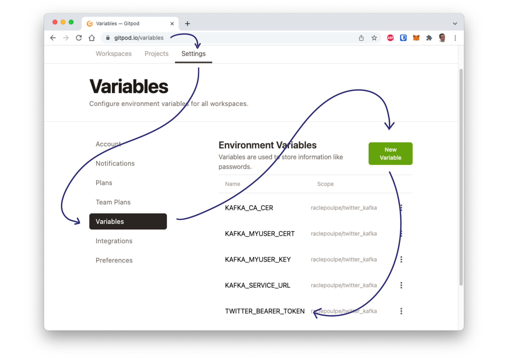
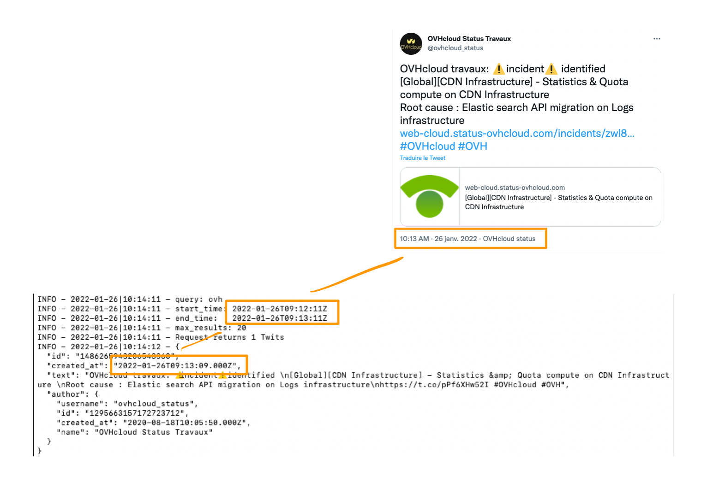

# STEP02 - Get access to the Twitter API


[](https://gitpod.io/#https://github.com/raclepoulpe/twifka/tree/main/step02)

For this tutorial, you need to have a Twitter developer account.
Reference: [https://developer.twitter.com/en/docs/twitter-api/getting-started/getting-access-to-the-twitter-api](https://developer.twitter.com/en/docs/twitter-api/getting-started/getting-access-to-the-twitter-api)

## Signup for a developer account 

Signing up for a developer account is quick and easy! Just click on the link below, answer a few questions, and you can start exploring and building on the Twitter API v2 using Essential access.

[Sign Up](https://developer.twitter.com/en/portal/petition/essential/basic-info)

## Save your App's key and tokens

From your Developer Portal, select your project, and click on the "Keys and tokens" tab.

We want to save this values in a dedicated file.

Create a file producer/TWITTER_API_properties.sh like this:

```bash
BEARER_TOKEN=""
```

Then fill the desired value with yours, and save the file.

Make the properties script executable by executing this command:

```bash
chmod u+x producer/TWITTER_API_properties.sh
```

> :information_source: If you're using Gitpod, as explained at step01, you can create a TWITTER_BEARER_TOKEN variable with a base64 encoding of your token as its value.
>

>
> Thanks to these few lines present in the .gitpod.yml file:
```yaml
- name: Create TWITTER_API_properties.sh file
  command: cat TWITTER_API_properties.sh.template | sed -e "s/TWITTER_BEARER_TOKEN/$(echo ${TWITTER_BEARER_TOKEN}|base64 -d)/g"> TWITTER_API_properties.sh && rm TWITTER_API_properties.sh.template && gp sync-done twitterProperties
```
>
> the TWITTER_API_properties.sh file will be generated automatically with the correct information each time the Gitpod workspace is created.
> 

## Test your Twitter API access

Before going any further, take a look at some useful Twitter API references:

https://developer.twitter.com/en/docs/twitter-api/getting-started/about-twitter-api

https://developer.twitter.com/en/docs/twitter-api/migrate/twitter-api-endpoint-map

### build the request

Few steps are necessary before sending the first request.

#### Urlencode

First, the query must be URL encoded. As this tutorial is written in Bash, this simple function do the job:

```bash
urlencode() {
    # urlencode <string>

    old_lc_collate=$LC_COLLATE
    LC_COLLATE=C

    local length="${#1}"
    for (( i = 0; i < length; i++ )); do
        local c="${1:$i:1}"
        case $c in
            [a-zA-Z0-9.~_-]) printf '%s' "$c" ;;
            *) printf '%%%02X' "'$c" ;;
        esac
    done

    LC_COLLATE=$old_lc_collate
}
```

Copy and paste this code into a new file **producer/PRODUCER_functions.sh**, then save it.

(Find the reference of this code here: https://jonlabelle.com/snippets/view/shell/url-encode-and-decode-values-in-bash)

#### Date format, start time and end time

You must be informed of the date format, which is **UTC +%Y-%m-%dT%H:%M:%SZ**

When you send a request, it is recommended to send two datetimes, one is for the the beginning of the search, and the other for the end.
You cannot make a search less than 30 seconds, that's why in this tutorial all requests are defined with an endtime "- 1 min".

Our Twitter producer will send request every minute, so the range will be setted from -2 minutes to -1 minute.

Translated into Bash language, this look like this:

```bash
#start_time: now - 2 min 
start_time=$(date --date='-120 seconds' '+%Y-%m-%dT%H:%M:%SZ')

#end_time:   now - 1 min
end_time=$(date  --date='-60 seconds' '+%Y-%m-%dT%H:%M:%SZ')
```

Example:



Note: If you are using a macos version of the *date* package, synthax is different, it should look like:

```bash
#start_time: now - 2 min
start_time=$(date -u -v-2M '+%Y-%m-%dT%H:%M:%SZ')

#end_time:   now - 1 min
end_time=$(date -u -v-1M '+%Y-%m-%dT%H:%M:%SZ')
```

#### Requested fields

Reférence: https://developer.twitter.com/en/docs/twitter-api/tweets/search/quick-start/recent-search

Whe build the request with:
- **created_at** to get de created datetime.
- **max_results** to limit the number of responses.
- **start_time** and **end_time** to define a range.
- **expansions** for requesting more deatailed information from the author.

This is how the request part should be like:

```bash
tweet.fields=created_at&max_results=$max_results&start_time=$start_time&end_time=$end_time&expansions=author_id&user.fields=created_at
```

And this is how the response should be like:

```json
{
  "id": "1486265943206543360",
  "created_at": "2022-01-26T09:13:09.000Z",
  "text": "OVHcloud travaux: ⚠️incident⚠️ identified \n[Global][CDN Infrastructure] - Statistics &amp; Quota compute on CDN Infrastructure \nRoot cause : Elastic search API migration on Logs infrastructure\nhttps://t.co/pPf6XHw52I #OVHcloud #OVH",
  "author": {
    "username": "ovhcloud_status",
    "id": "1295663157172723712",
    "created_at": "2020-08-18T10:05:50.000Z",
    "name": "OVHcloud Status Travaux"
  }
}
```

### Execute the request

Now we are ready to request the Twitter API from a shell.

Load the Twitter API properties:

```bash
. producer/TWITTER_API_properties.sh
```  

Load the additional functions:

```bash
. producer/PRODUCER_function.sh
```

Define a query:

```bash
export query="#twitter"
```

Encode the query:

```bash
export urlEncodedQuery="$(urlencode $query)"
```

Define a limit for the number of responses:

```bash
export max_results="20"
```

Define your start and end datetimes:

```bash
export start_time=$(date -u -v-2M '+%Y-%m-%dT%H:%M:%SZ')
export end_time=$(date -u -v-1M '+%Y-%m-%dT%H:%M:%SZ')
```

Save the request as variable:

```bash
export req="https://api.twitter.com/2/tweets/search/recent?query=$urlEncodedQuery&tweet.fields=created_at&max_results=$max_results&start_time=$start_time&end_time=$end_time&expansions=author_id&user.fields=created_at"
```

Execute the request:

```bash
curl -s "$req" -H "Authorization: Bearer $BEARER_TOKEN"
```

You can use the **jq** tool for an embedded output:

```bash
curl -s "$req" -H "Authorization: Bearer $BEARER_TOKEN" | jq
```

If everything is OK, you should get a response like:

```json
{
  "data": [
    {
      "created_at": "2022-01-26T10:11:37.000Z",
      "text": "RT @BonosSocial: 🚨 #ATENCIÓN: Usuarios del #SistemaPatria ya pueden registrar y sincronizar tu cuenta personal de #Twitter con la #Platafor…",
      "id": "1486280658662141957",
      "author_id": "3382366348"
    },


    {
      "created_at": "2022-01-26T10:10:38.000Z",
      "text": "今日、つぶやき用のTwitter始めました。\nフォローといいねとコメント来るかな？\n\n#今日 #Twitter #Twitter始めました #フォローほしい #いいねほしい #コメントください #待ってます",
      "id": "1486280412317974531",
      "author_id": "1486276220798980096"
    }
  ],
  "includes": {
    "users": [
      {
        "name": "Moraima",
        "created_at": "2015-07-18T22:10:17.000Z",
        "username": "moraims1",
        "id": "3382366348"
      },


      {
        "name": "ねこだぬき（いおりん。）",
        "created_at": "2022-01-26T09:54:15.000Z",
        "username": "nekodanuki_saga",
        "id": "1486276220798980096"
      }
    ]
  },
  "meta": {
    "newest_id": "1486280658662141957",
    "oldest_id": "1486280412317974531",
    "result_count": 17
  }
}

```

(The response is volontary truncated)

Congratulations! You've reached the end of the second part of this tutorial !

You can put away your mask and snorkel 🤿, have a break ☕, and get ready to hit the third leg of this tutorial.

🥊 [Knock the Step03](../../..//tree/main/step03)
