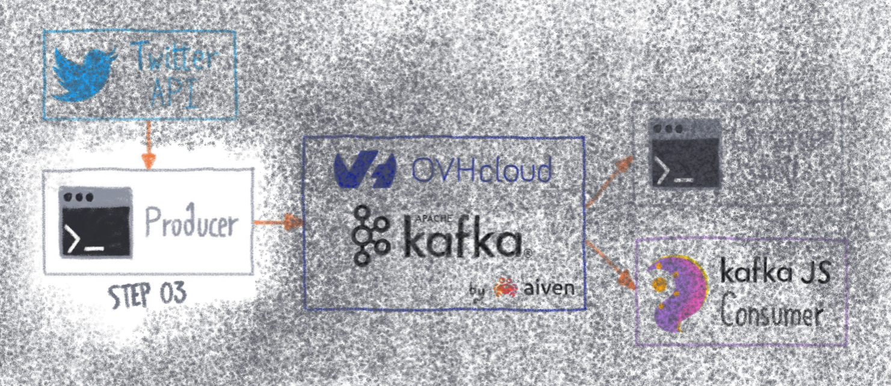

# STEP03 - Create and launch the producer daemon



[](https://gitpod.io/#https://github.com/raclepoulpe/twifka/tree/main/step03)

In this third part of the tutorial, we will create a daemon, which will request the Twitter API every minute and then send the result to a Kafka producer.

## Create a properties files

In order to make the script clearer, it is better to externalize some variables in a configuration file.

Create a new file named **producer/PRODUCER_properties.sh** and insert the text below:

```bash
### Twitter API request parts
# query
query="ovh"
# Max results
max_results=20

### Script Log level
# set LOGLEVEL=INFO for INFO level
LOGLEVEL="INFO"
```

As seen on step02, whe put the request values of query and max_results there, and add a LOGLEVEL variable, for debugging.
We will explain this part later.

## Create the producer script

Create a file **producer/producer.sh**

```bash
touch producer/producer.sh
```

Now open the file and add

```bash
#!/bin/bash
```

### Load properties and functions

Add this to load the properties and functions files.

```bash
. TWITTER_API_properties.sh
. PRODUCER_properties.sh
. PRODUCER_functions.sh
```

### Create a log function

It is always a good practice to add a function to manage logs display, for this tutorial, add this:

```bash
log() {
if [ "$LOGLEVEL" == "INFO" ];
then
        echo "INFO - $(date '+%Y-%m-%d|%H:%M:%S') - $1"
fi
}
```

The function read the value of the LOGLEVEL variable defined in the producer/PRODUCER_properties.sh file.
If value equals "INFO", then the function prints the date followed by the intput text.

You can add many values as you want.

### Build the request

Building the request is as simple as explained in the step02 part of the tutorial.

- Encode the query
```bash
urlEncodedQuery=$(urlencode "$query")
log "query: $query"
log "urlEncodedQuery: $urlEncodedQuery"
```

- Define the start_time and the end_time of your search:
```bash
start_time=$(date -u -v-2M '+%Y-%m-%dT%H:%M:%SZ')
end_time=$(date -u -v-1M '+%Y-%m-%dT%H:%M:%SZ')
log "start_time: $start_time"
log "end_time: $end_time"
```

- Set the req variable
```bash
req="https://api.twitter.com/2/tweets/search/recent?query=$urlEncodedQuery&tweet.fields=created_at&max_results=$max_results&start_time=$start_time&end_time=$end_time&expansions=author_id&user.fields=created_at"
```

### Get the response

Create a new **req** variable directly with the result of the curl query:

```bash
resp=$(curl -s "$req" -H "Authorization: Bearer $BEARER_TOKEN")
```

### Count and test messages

Depending on the request, there will not necessarily be a response, so we start by testing the number of messages.
If this return number is null, then we do nothing, the script ends.

- Get the number of returned messages

As we handle JSON format, we use **jq** to simplify our work. You can find all information about **jq** here: [jq official site](https://stedolan.github.io/jq).

```bash
nb_result=$(echo $resp | jq '.meta|.result_count')
log "nb_result: $nb_result"
```

- Create a if block 

```bash
if [ $nb_result -gt 0 ]
then
	log "Request returns $nb_result Tweets"

	# The futur code come here

else
	log "Request returns no response"
fi
```

### Format the Kafka message

Now it's a more complex part, because we want to change the response initial format, by replacing it with this one:

```json
{
 "id": "",
 "created_at": "",
 "text": "",
 "author": {
   "username": "",
   "created_at": "",
   "name": "",
   "id": ""
 }
}
```

Remember, on the previous response format, the author informations are separated from the tweet informations. In the desired format, it becomes a part of the response.

To do that, we are using jq.
Copy and paste the following code inside the if block:

```bash
echo $resp |jq '.data[]|.id' | \
while read i;\
 do
  id="${i//\"/}";\
  author_id=$(echo $resp | jq --arg twid $id '.data[] | select(.id==($twid)) | .author_id');\
  created_at=$(echo $resp | jq --arg twid $id '.data[] | select(.id==($twid)) | .created_at');\
  text=$(echo $resp | jq --arg twid $id '.data[] | select(.id==($twid)) | .text');\
  user=$(echo $resp | jq --arg aid ${author_id//\"/} '.includes[][] | select(.id==($aid))');\
  json="$(echo "{\"id\":$i,\"created_at\":$created_at,\"text\":$text,\"author\":$user}" | jq )";\
 
  log "$json";\
 
  # Here will stand the code for sending the json object to Kafka

 done
```

### Send message to Kafka

The missing part inside the previous while-do loop is the code that send the json object to the Kafka broker.

Whe covered the way to do this in the step01 part of this tutorial, we will use **kafkacat**.

- Install kafkacat locally:

(detailed installation procedure can be found here : https://github.com/edenhill/kcat)

```bash
$ sudo apt-get install kafkacat
```

- Create or modify the kafkacat.conf script:

```bash
bootstrap.servers=kafka-abc123456-obabcdd987.database.cloud.ovh.net:20186
enable.ssl.certificate.verification=false
ssl.ca.location=ssl/ca.cer
security.protocol=ssl
ssl.key.location=ssl/myuser.key
ssl.certificate.location=ssl/myuser.cert
```

Add this inside the loop:

```bash
  echo $json | kakfacat -q -F kafkacat.conf -P -t mytopic;\
```

### Summary

The producer script is complete, it should look like this:

```bash
#!/bin/bash

. TWITTER_API_properties.sh
. PRODUCER_properties.sh
. PRODUCER_functions.sh

log() {
if [ "$LOGLEVEL" == "INFO" ];
then
        echo "INFO - $(date '+%Y-%m-%d|%H:%M:%S') - $1"
fi
}

urlEncodedQuery=$(urlencode "$query")
log "query: $query"

start_time=$(date --date='-120 seconds' '+%Y-%m-%dT%H:%M:%SZ')
end_time=$(date --date='-60 seconds' '+%Y-%m-%dT%H:%M:%SZ')

log "start_time: $start_time"
log "end_time:   $end_time"

req="https://api.twitter.com/2/tweets/search/recent?query=$urlEncodedQuery&tweet.fields=created_at&max_results=$max_results&start_time=$start_time&end_time=$end_time&expansions=author_id&user.fields=created_at"

resp=$(curl -s "$req" -H "Authorization: Bearer $BEARER_TOKEN")

nb_result=$(echo $resp | jq '.meta|.result_count')

if [ $nb_result -gt 0 ] 
then
 log "Request returns $nb_result Tweets"

 echo $resp |jq '.data[]|.id' | \
 while read i;\
  do
  id="${i//\"/}";\
  author_id=$(echo $resp | jq --arg twid $id '.data[] | select(.id==($twid)) | .author_id');\
  created_at=$(echo $resp | jq --arg twid $id '.data[] | select(.id==($twid)) | .created_at');\
  text=$(echo $resp | jq --arg twid $id '.data[] | select(.id==($twid)) | .text');\
  user=$(echo $resp | jq --arg aid ${author_id//\"/} '.includes[][] | select(.id==($aid))');\
  json="$(echo "{\"id\":$i,\"created_at\":$created_at,\"text\":$text,\"author\":$user}" | jq )";\
 
  log " - Push tweet with id ${id} to Kafka..";\
  echo $json | kafkacat -q -F kafkacat.conf -P -t mytopic;\
 done
else
 log "Request returns no response"
fi
```
## Test

Let's execute the script, and see the result.

Start by defining or adjusting a Twitter request inside the producer/PRODUCER_properties.sh file, eg:

```bash
query="#twitter"
```

Inside an another shell, navigate to the producer folder, then open a consumer, with the **kafkacat** tool, as explained in step01:
```bash
kafkacat -F /tmp/kafkacat.conf -t mytopic -C
```

Now, from your main shell, from the producer folder, simply execute the producer.sh script:
```bash
./producer.sh
```

🎬 See the code in action:

https://user-images.githubusercontent.com/8849340/154311669-51d2ceee-0159-42dd-be20-fc8245652069.mp4

## Create the daemon

We prefer to delegate script scheduling management to another script.

A simple deamon-like script names daemon.sh, will run the producer.sh every minute.

Create the file producer/daemon.sh, and make it executable:

```bash
touch producer/daemon.sh
chmod u+x producer/daemon.sh
```

Copy and paste this content inside the file:

```bash
#!/bin/bash

while true
do
        echo "INFO - $(date '+%Y-%m-%d|%H:%M:%S') - Producer daemon - Check new Twits.."
        ./producer.sh
        sleep 60
done
```

Now, simply start the daemon with this command:

```bash
./daemon.sh
```

Press CTRL + C to quit.

Congratulations! your producer is fully operational!

You are still here? Great ! Follow 👉 [Step04](../../..//tree/main/step04) to create your first Kafka consumer in Bash.

