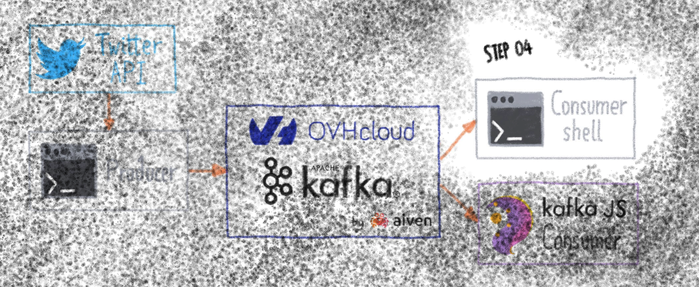

# STEP04 - Create a Bash consumer



[](https://gitpod.io/#https://github.com/raclepoulpe/twifka/tree/main/step04)

What are we going to need?

First,a kafka command line client. Guess what? We are going to use kafkacat!
And the last things we need are the differents given SSL certificates to access the Kafka cluster.
That's all!

### Create the consumers structure

Create the **consumers** directory, then the **consumers/bash** directory, finally go to this directory.

```bash
mkdir consumers
mkdir consumers/bash
cd consumers/bash
```

### Add certificates and configuration files

Create the **ssl** directory and paste there the three requested certificates **ca.cer**, **myuser.cert** and **myuser.key**

Create (or copy-paste) the kafkacat configuration file **kafkacat.conf**, exactly as done on previous steps.

Now your directory should look like this:
```bash
$ ls -la
total 4
drwxr-xr-x 3 gitpod gitpod  38 Feb 17 14:55 .
drwxr-xr-x 3 gitpod gitpod  37 Feb 17 14:55 ..
-rw-r--r-- 1 gitpod gitpod 236 Feb 17 14:34 kafkacat.conf
drwxr-xr-x 2 gitpod gitpod  57 Feb 17 14:33 ssl

$ ls -la ssl/
total 12
drwxr-xr-x 2 gitpod gitpod   57 Feb 17 14:33 .
drwxr-xr-x 3 gitpod gitpod   38 Feb 17 14:55 ..
-rw-r--r-- 1 gitpod gitpod 1537 Feb 17 14:33 ca.cer
-rw-r--r-- 1 gitpod gitpod 1533 Feb 17 14:33 myuser.cert
-rw-r--r-- 1 gitpod gitpod 2484 Feb 17 14:33 myuser.key
```

### Create the consumer script

create a new **consumer.sh** file, make it executable, and insert this lines:

```bash
#!/bin/bash
  
kafkacat -F kafkacat.conf -t mytopic
```

That's all, the default kafkacat mode is Consume, so you don't need to specify it with "-C", just declare the configuration file with "-F" and the topic name with "-t".

Now start the consumer, then start the producer daemon, each minute, the result of your Twitter request will appear in the consumer shell window.

https://user-images.githubusercontent.com/8849340/154515771-91cc2847-86fb-41d0-942a-b0ef7728e927.mp4

Enjoy!

Slide to 🛝  [Step05](../../..//tree/main/step05)
