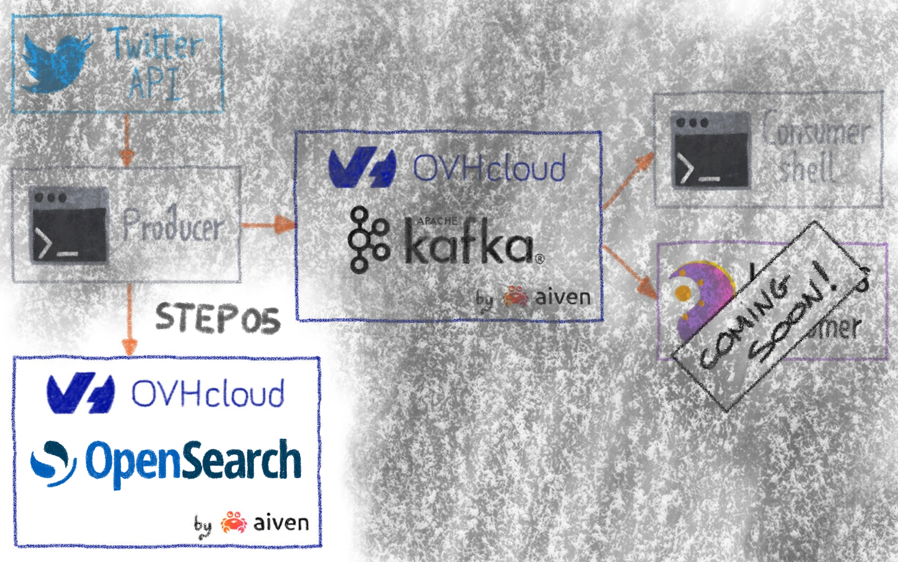
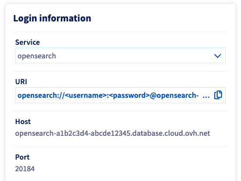
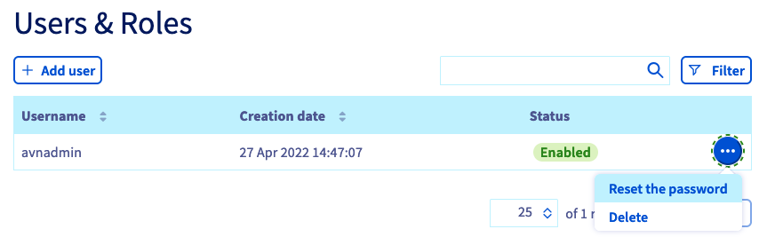
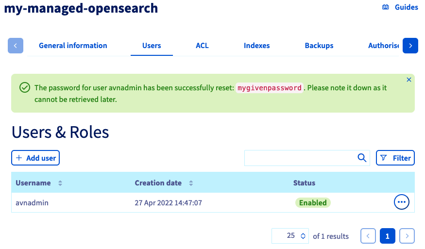
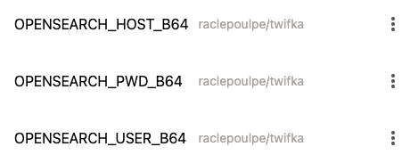
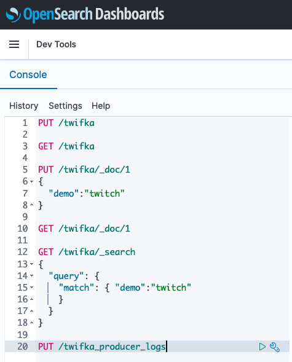

# STEP05 - Push producer logs to Opensearch
  


[](https://gitpod.io/#https://github.com/raclepoulpe/twifka/tree/main/step05)

## Create new OVHcloud managed Opensearch

According this tutorial https://docs.ovh.com/gb/en/publiccloud/databases/opensearch/getting-started/:

- Subscribe to a new Managed Opensearch service, and name it <span style="color: orange;">**my-managed-opensearch**</span>

## Manage Gitpod variables



$ echo "opensearch-a1b2c3d4-abcde12345.database.cloud.ovh.net" | base64
b3BlbnNlYXJjaC1hMWIyYzNkNC1hYmNkZTEyMzQ1LmRhdGFiYXNlLmNsb3VkLm92aC5uZXQK

$ echo "avnadmin" | base64
YXZuYWRtaW4K





$ echo "mygivenpassword" | base64
bXlnaXZlbnBhc3N3b3JkCg==



- OPENSEARCH_HOST_B64
- OPENSEARCH_USER_B64
- OPENSEARCH_PWD_B64

## Opensearch Dashboard

### Dev Tools



```
PUT /twifka

GET /twifka

PUT /twifka/_doc/1
{
  "demo":"twitch"
}

GET /twifka/_doc/1

GET /twifka/_search
{
  "query": {
    "match": { "demo":"twitch"
    }
  }
}

PUT /twifka_producer_logs
```


